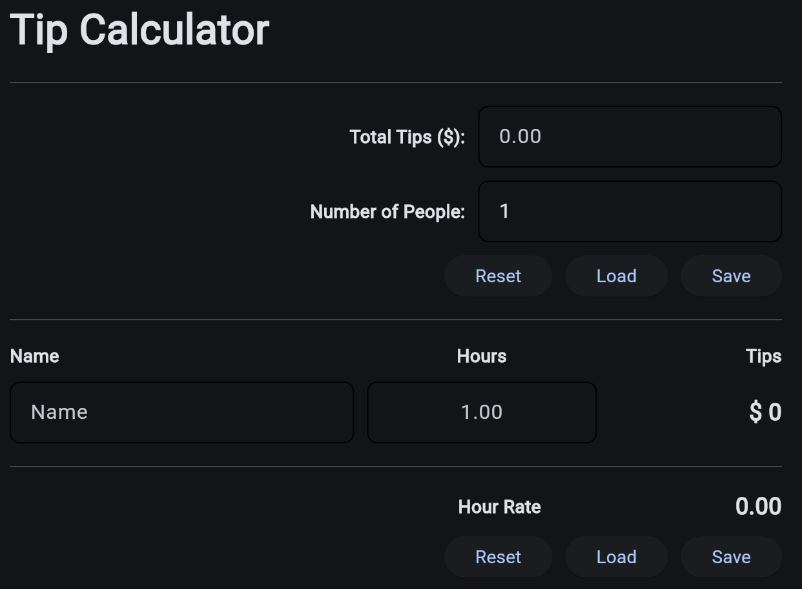
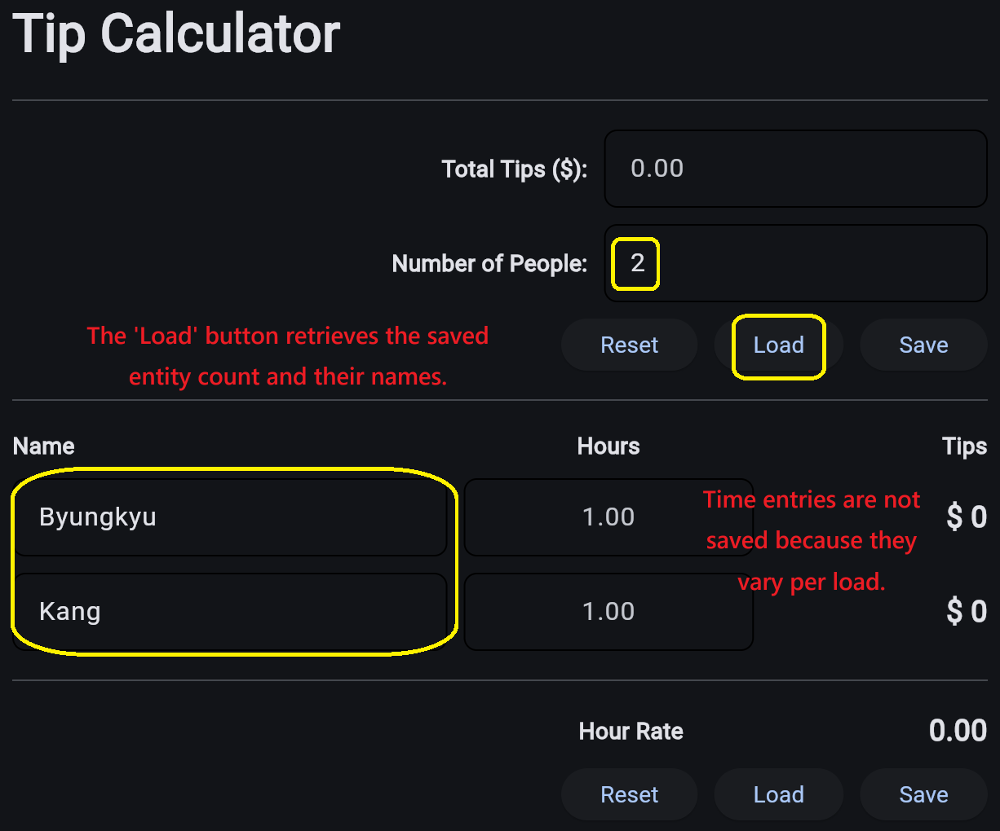
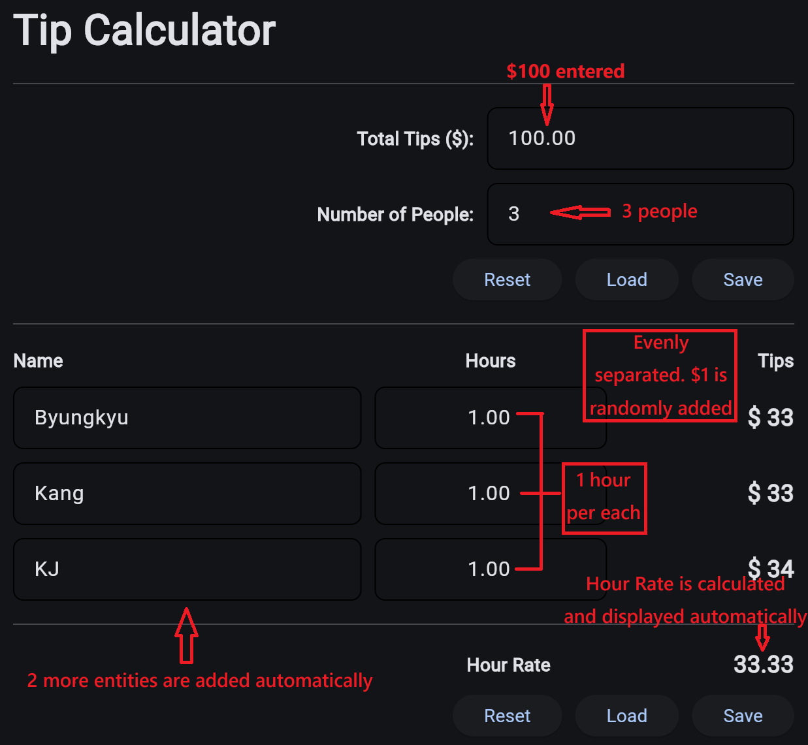
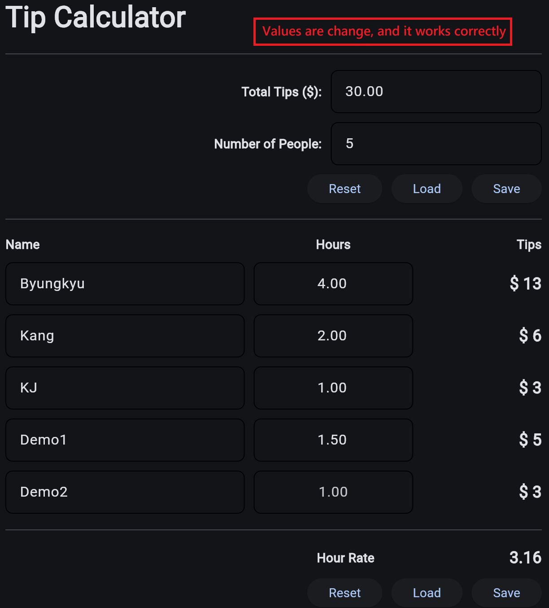
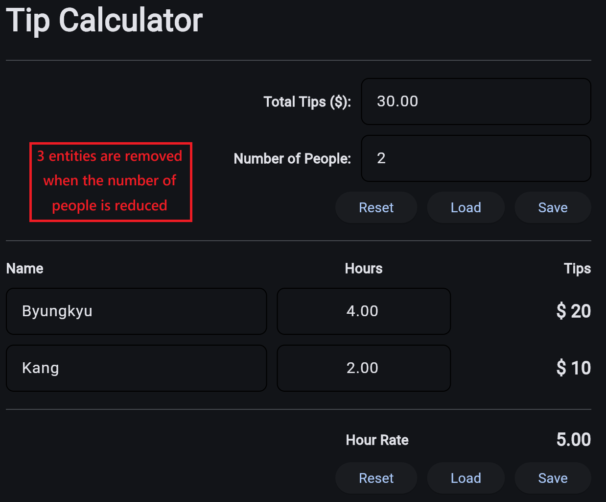
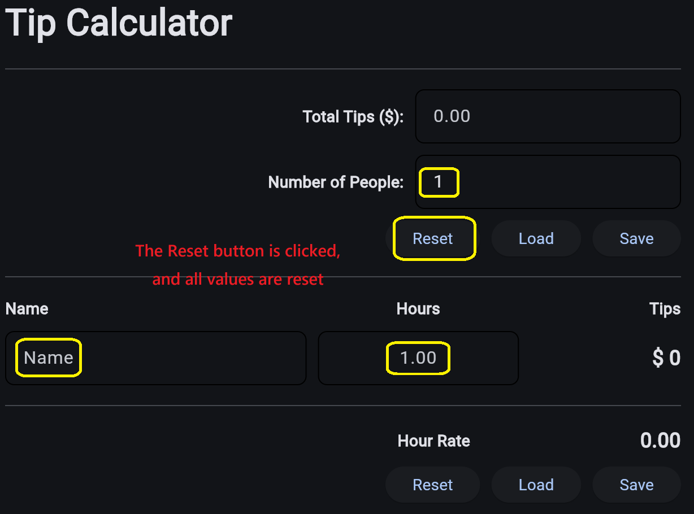

# ☕ Starbucks Tip-Out Calculator

A specialized web application designed for Starbucks baristas to fairly and accurately distribute shared tips based on individual work hours.

---

## 🚀 Live Demo

[Launch Starbucks Tip-Out App 🔗](https://starbucks-tip-out.onrender.com)

---

## 📌 Background

This project was created to solve a real-world problem shared by a Starbucks employee who is responsible for distributing shared tips among people based on hours worked.

Most tip calculator apps available in app stores return results down to the cent. However, in actual workplace use, tips often need to be distributed in whole-dollar amounts. That made the process inconvenient because the user still had to manually round each result and then check whether the sum of all rounded tip amounts still matched the original total tip amount.

To eliminate that extra work, I built this calculator to return tip amounts in whole dollars while still maintaining fairness and accuracy.

---

## 📖 Overview

The Starbucks Tip-Out Calculator is a lightweight web application that distributes shared tips fairly based on each barista’s hours worked.

The app takes the total tip amount, the number of people, each person’s name, and their hours worked, then calculates each individual share. Final results are returned in whole-dollar amounts. If rounding creates a difference between the original total tip amount and the sum of all distributed tips, the remaining amount is reassigned fairly using a weighted remainder distribution approach. This ensures that the final distributed total does not fall short of or exceed the original tip amount.

In addition to tip calculation, the app also includes practical convenience features such as dynamic row creation and removal, reset functionality, and save/load support for previously entered names and group size.

---

## 📸 Screenshots & Demo Walkthrough

### 1. Main Interface
The default starting screen of the app.  
Users can enter the total tip amount, set the number of people, and use the Reset, Load, and Save buttons before entering people details.



---

### 2. Load Saved Names and Group Size
The **Load** button restores previously saved people names and the saved group size.  
Only the **number of people** and **names** are loaded. Hours are not restored because they usually change for each new tip-out calculation.



---

### 3. Basic Tip Calculation Workflow
After entering the total tip amount and the number of people, the app automatically creates the required number of rows.  
Each person’s share is calculated based on the hours entered, and the hourly tip rate is displayed automatically.



---

### 4. Recalculation with Updated Values
The app recalculates tip distribution immediately when values change.  
This includes updated total tip amounts, different group sizes, and different hour inputs for each person.



---

### 5. Dynamic Row Removal
When the number of people is reduced, extra rows are automatically removed.  
This keeps the interface aligned with the current group size and updates the tip calculation accordingly.



---

### 6. Reset Functionality
The **Reset** button restores the calculator to its default state.  
It resets the number of people, clears entered names and tip values, and returns the app to a clean starting screen.



---

## ✨ Key Features

- Precise Tip Distribution  
  Calculates each person’s tip share based on total hours worked.

- Whole-Dollar Results  
  Returns final tip amounts in whole dollars for practical real-world usage.

- Fair Remainder Handling  
  When rounding creates a difference, the remaining amount is distributed fairly so that the final total always matches the original tip amount.

- Dynamic UI  
  Automatically adds or removes rows as the number of people changes.

- Save / Load Support  
  Saves and reloads previously entered names and group size for faster repeated use.

- Reset Functionality  
  Resets the app to its default state with a single click.

---

## 🛠 Tech Stack

- Language: Python
- Framework: Flet
- Deployment: Render
- Runtime / Serving: FastAPI and Uvicorn
- Data Handling: JSON and browser local storage

---

## 🧠 Technical Highlights

- Event-Driven Architecture  
  Managed interactive UI behavior using callback handlers such as `on_change`, `on_blur`, `on_submit`, and button click events.

- Dynamic Row Generation  
  Built a flexible interface that creates or removes people rows based on the current number of people.

- Data Persistence  
  Implemented Save / Load functionality for previously entered names and group size using browser-side storage.

- Fair Rounding Logic  
  Added a remainder distribution strategy so that rounding to whole dollars still preserves the total tip amount.

- Input Validation and Stability  
  Handled invalid or empty values safely to prevent broken calculations during user input.

- Web Deployment Experience  
  Packaged and deployed the application as a lightweight web app using Docker, FastAPI, Uvicorn, and Render.

---

## 📂 Project Structure

```text
Tip_Calculator/
├── Dockerfile
├── requirements.txt
├── tip_calc_main.py
└── assets/
    └── Demo_Screenshot/
        ├── 01.Main.png
        ├── 02.Demo1.png
        ├── 03.Demo2.png
        ├── 04.Demo3.png
        ├── 05.Demo4-Reset.png
        └── 06.Demo5-Save_Load.png